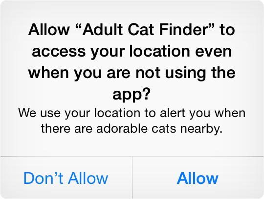
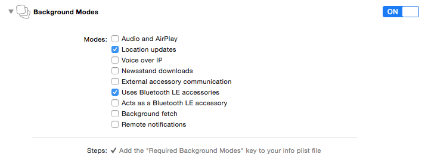

# Passworks Beacon Management Platform

Lighthouse is the SDK that connects Passworks.io beacons service ([http://beacons.passworks.io](http://beacons.passworks.io)) to your iOS application.
In the Passworks.io dashboard you can add your own beacons, manage your tags (premises/virtual areas) and the events associated with beacon entry or exit.

> Please be advised that the current SDK is in beta so it's not production ready and features my change in the future without notice.

> While in beta if you wish to receive notifications about new builds of the SDK please send an e-mail to support@passworks.io

## Integration

Drag `Lighthouse.bundle` and `Lighthouse.framework` to 'Frameworks' in your workspace. If prompted, check the "Copy items to destination's group folder" checkbox to make sure the framework and the resources are copied to your project.

## Setup

### Step 1 - SDK Setup

To setup the SDK all you are required to do is call `setupWithToken:` on your application's `AppDelegate` subclass on the `application:didFinishLaunchingWithOptions:` method.

Objective-C:
```objective-c
- (BOOL)application:(UIApplication *)application 
        didFinishLaunchingWithOptions:(NSDictionary *)launchOptions {
  [Lighthouse setupWithToken:@"YOUR-APP-TOKEN"];
  // The rest of your code goes here...
}
```

Swift:

```swift
func application(application: UIApplication, didFinishLaunchingWithOptions launchOptions: [NSObject: AnyObject]?) -> Bool {
  Lighthouse.setupWithToken("YOUR-APP-TOKEN")
  // The rest of your code goes here...
}
```

### Step 2 - Core Location Permission

To make sure your application can scan for beacons when it is on background, you will also be required to add `NSLocationAlwaysUsageDescription` value to your applications's `Info.plist`. The value is the message displayed on the popup prompting the user to give permission.



### Step 3 - Background Modes

To make sure your application can trigger events on nearby beacons while it is in background, you need to give it permission for running in the background, the two modes required are `Location updates` and `Uses Bluetooth LE accessories`.



## Beacon Scanning

### Starting

Lighthouse allows your app to be on the lookout for nearby beacons, as such, it requires you to turn on the beacon scanning feature by calling the `lightUp` method on Lighthouse.

Objective-C:

```objective-c
[[Lighthouse sharedInstance] lightUp];
```

Swift:

```swift
Lighthouse.sharedInstance().lightUp()
```

This method call will trigger the Core Location Permission popup in case you have not asked the user for permission beforehand.

### Stopping

In case you want to stop ranging for beacons, you can call the `turnOff` method which will then stop all location based beacon ranging.

```objective-c
[[Lighthouse sharedInstance] turnOff];
```

```swift
Lighthouse.sharedInstance().turnOff()
```

### Updating

Lighthouse updates its database in several cases, when the SDK is setup, when the application returns to foreground or when an explicit call to `refresh` is triggered. This will then refresh all the beacons, events and tags set in the Passworks.io dashboard.

Objective-C:

```objective-c
[[Lighthouse sharedInstance] refresh];
```

Swift:

```swift
Lighthouse.sharedInstance().refresh()
```

### Delegating

Lighthouse will adopt the behavior defined in the Passworks.io dashboard, so any events will be triggered in the background without requiring any aditional code from you. But for a more advanced usage, Lighthouse supports a delegating protocol for more precise control over functionality.

To set a delegate just set the property on the SDK.

Objective-C:

```objective-c
[Lighthouse sharedInstance].delegate = self;
```

Swift:
```swift
Lighthouse.sharedInstance().delegate = self
```

The object being assigned needs to conform to the `LHDelegate` protocol. All the protocol's interface is optional, so not all the methods need to be implemented.

`lighthouseBeaconsRefreshed:` is called when the database is updated from any of the ways mentioned before (see the **Updating** section)

`lighthouseBeaconDidChangeProximity:` is called when a nearby beacon changes it proximity between either 2 of these: `CLProximityImminent`, `CLProximityNear`, `CLProximityFar` or `CLProximityUnknown`.

`lighthouseEventTriggered:onBeacon` is called when an `LHEvent` is triggered by entering or exiting a given proximity of a `LHBeacon`. These events need to be mapped on the Passworks.io dashboard to be triggered.

`lighthouseShouldTriggerEvent:onBeacon:` is a delegate method to allow a better control of how the SDK should function, by default, the SDK triggers on any event occurring, you can return `false` to avoid triggering certain events.

### In App Behavior

By default, Lighthouse only triggers `UILocalNotifications` when the application is in background, because iOS does not support showing notifications when the application is in foreground. To allow better control over this caveat, Lighthouse allows triggering `UIAlertViews` corresponding to the notifications while the application is in foreground. This can be set through the `triggerAlertViewInForeground` property.

```objective-c
[Lighthouse sharedInstance].triggerAlertViewInForeground = YES;
```

```swift
Lighthouse.sharedInstance().triggerAlertViewInForeground = true
```

## Analytics

Lighthouse allows user tracking to get the best out of the analytics on top of the beacons solution. In order to identify the users to the Lighthouse SDK, you can call the `identifyUser`, `identifyUser:`, `identifyUser:attributes:` and `logout` methods.

`identifyUser` will trigger an annonymous identification (in case your application does not require your users to login and signup).

`identifyUser:` will take a `userId` for identification (which can be an e-mail, a username or even an actual id).

`identifyUser:attributes:` allows you to identify a user through a `userId` as well as receiving a dictionary of user attributes which may contain all the user information you want.

`logout` forces a previously identified user to become anonymous again. (same behavior as `identifyUser`)

## Database

Lighthouse allows you to dig into the database which is composed by `LHBeacons`, `LHTags` and `LHEvents`. 

The Lighthouse `sharedInstance` contains properties for `beacons`, `beaconsInRange`, `tags` and `events`. These represent arrays of their corresponding object models mentioned above.

### LHTag

The `LHTag` model represents the tags associated with beacons, in order to create **sessions**. It is composed by:

- `identifier`: Int - the tag identifier in Passworks.io.
- `name`: String - the tag name.
- `timeout`: Int - the timeout for closing sessions.
- `lastSeenAt`: NSDate - the timestamp for the last time the tag was found.
- `sessionId`: String - a unique session identifier randomly generated.

### LHBeacon

The `LHBeacon` model represents the physical beacons and is composed by:

- `identifier`: Int - the beacon identifier in Passworks.io.
- `name`: String - the beacon name.
- `uuid`: String - the UUID set in the physical beacon.
- `major`: Int - the major identifier set in the physical beacon.
- `minor`: Int - the minor identifier set in the physical beacon.
- `vendorName`: String - the name of the beacon's vendor.
- `vendorSlug`: String - the slug of the beacon's vendor.
- `tags`: [LHTag] - an array containing all the associated `LHTag` objects.
- `events`: [LHEvent] - an array containing all the associated `LHEvent` objects.
- `proximity`: CLProximity - the current proximity of the beacon.

### LHEvent

The `LHEvent` model represents the behavior of the Lighthouse framework when it encounters a `LHBeacon`. When certain conditions align the `LHEvent` should be triggered and a notification will be shown to the user. The model is composed by:

- `identifier`: Int - the event identifier in Passworks.io.
- `name`: String - the event name.
- `proximity`: CLProximity - the proximity in which the event should be triggered.
- `triggerOn`: LHEventTrigger - a switch between `Enter` or `Exit` in which the event should be triggered.
- `triggerOnce`: Bool - `true` in case the event should only be triggerd if it has passed the maximum `timeout` for all the tags associated with the beacon's tags, `false` in case it should consider its timeout as the `timeout`
- `type`: LHEventType - a switch between `URL`, `Notification`, `Webhook`, `Image` and `Passbook`, which will correspond to the action to take when the user opens up the local notification triggered by the event.
- `triggeredAt`: NSDate - a timestamp for when the event was last triggered.
- `timeout`: Int - the timeout to which the framework should not trigger multiple times the same event.
- `payload`: String - the content to use in the notification action.
- `notificationMessage`: String - the message to be presented to the user on the notification.

## Logging

Lighthouse allows the developer to choose whether to display logs or not, this can be set with the `setVerbose:` call. Verbose mode is enabled by default in debug builds and disabled otherwise.

Objective-C:

```objective-c
[Lighthouse setVerbose:YES];
```

Swift:

```swift
Lighthouse.setVerbose(true)
```


## Help us make it better

Please tell us how we can make the SDK better. If you have a specific feature request or if you found a bug, please use GitHub issues. Fork these docs and send a pull request with improvements.

To talk with us and other developers about the SDK [open a support ticket](https://github.com/passworks/lighthouse-ios-sdk/issues) or mail us at `api at passworks.io` if you need to talk to us.
